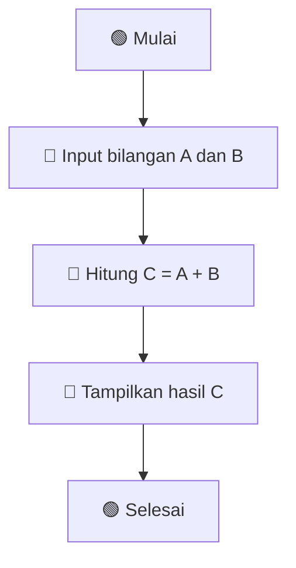
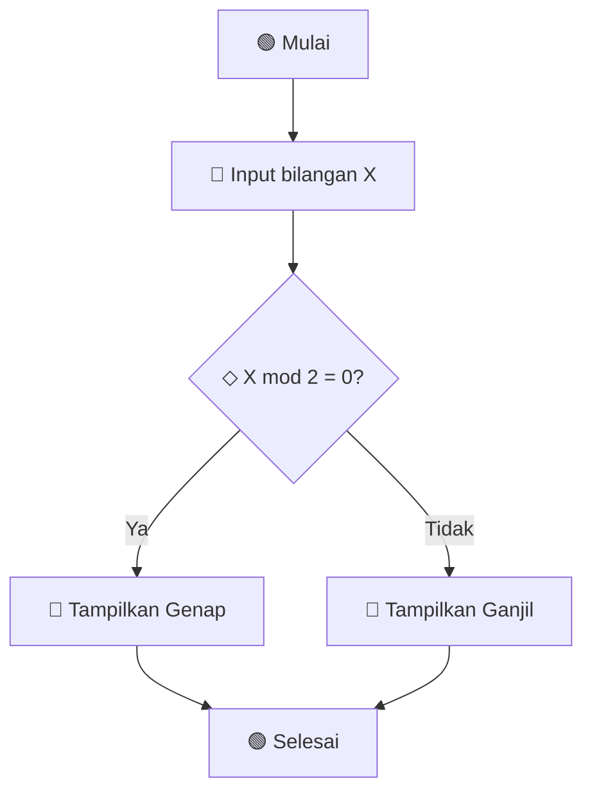
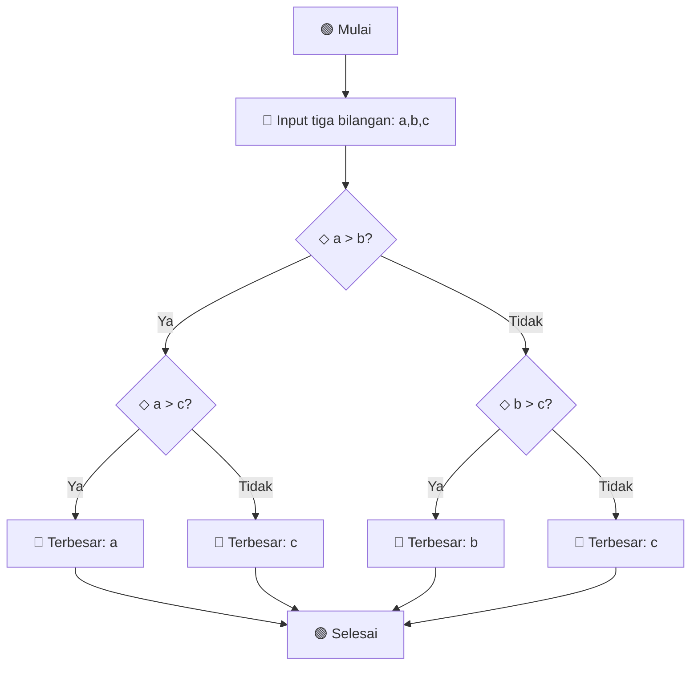
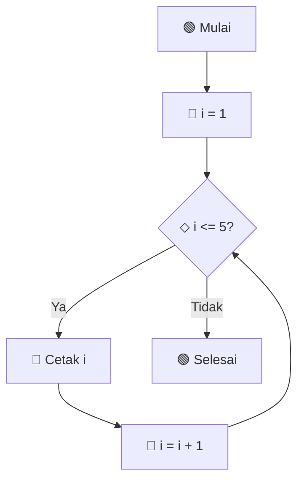
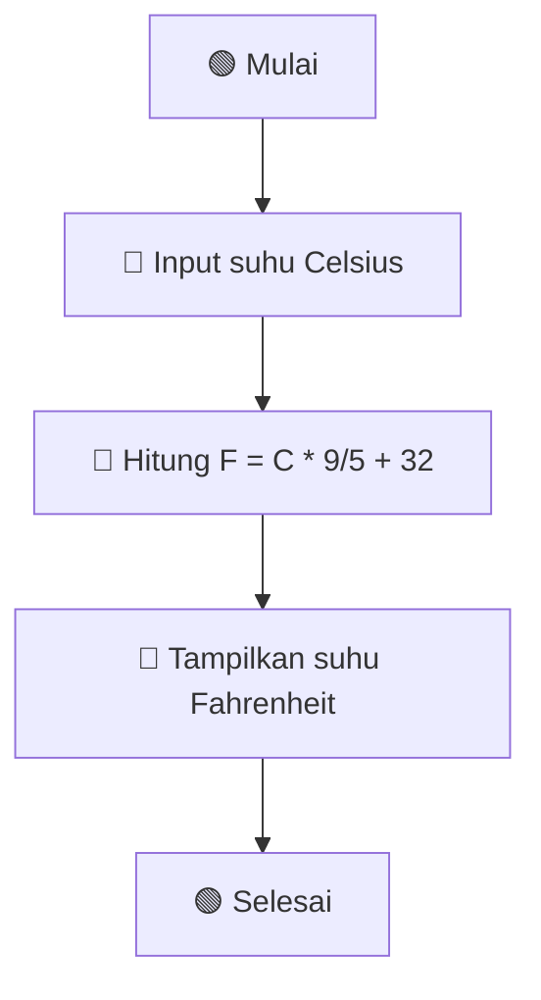
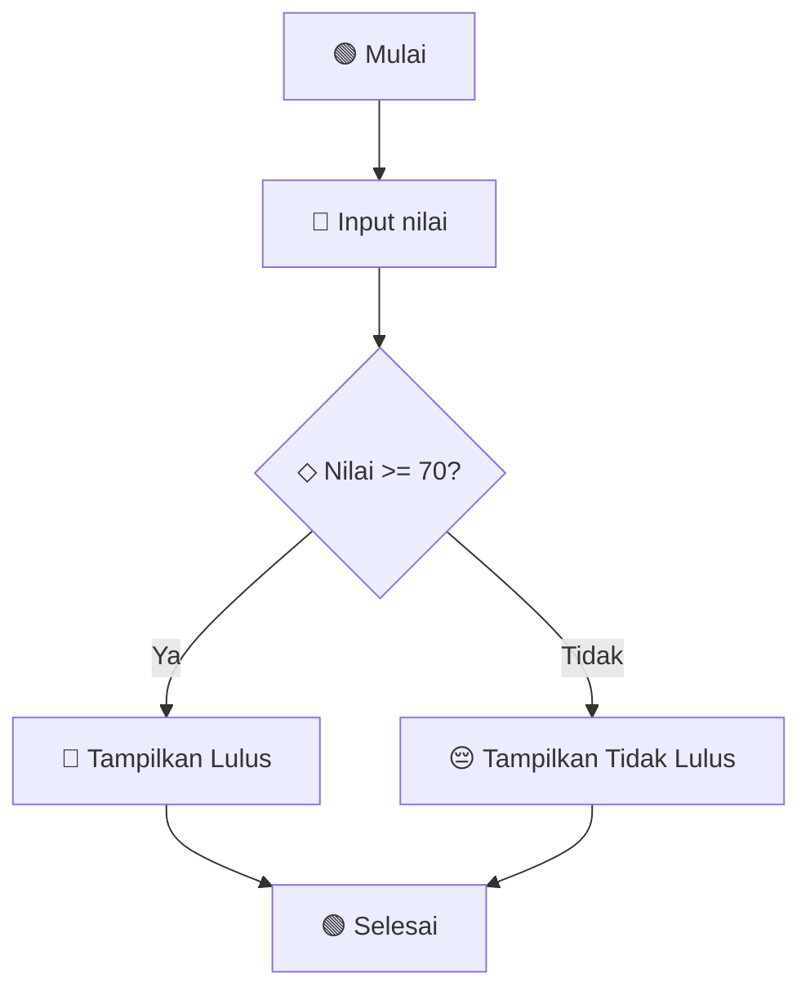
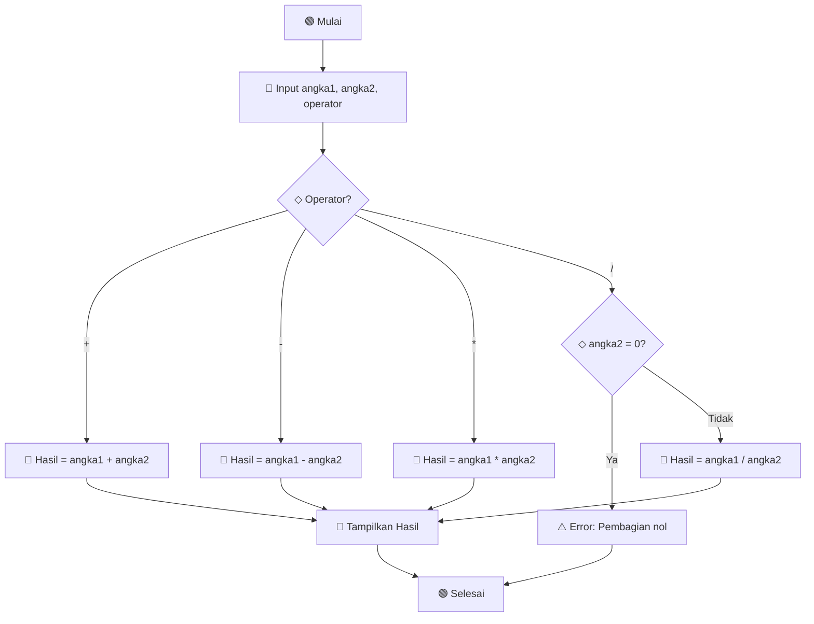

# 🚀 Materi Algoritma Dasar - Flowchart Edition

 


## 📚 Daftar Isi
- [📊 Pengenalan Flowchart](#-pengenalan-flowchart)
- [🔷 Simbol-simbol Flowchart](#-simbol-simbol-flowchart)
- [🎯 Contoh Flowchart Algoritma](#-contoh-flowchart-algoritma)
- [💡 Tips Membuat Flowchart](#-tips-membuat-flowchart)
- [🛠️ Latihan Membuat Flowchart](#️-latihan-membuat-flowchart)

## 📊 Pengenalan Flowchart

### ❓ Apa itu Flowchart?
**Flowchart** adalah diagram yang mewakili algoritma, workflow, atau proses dengan menunjukkan langkah-langkah sebagai kotak berbagai jenis dan urutannya dengan menghubungkan panah.

### 🎯 Tujuan Flowchart
- 📖 Memvisualisasikan alur program
- 🔍 Memudahkan analisis masalah
- 🗣️ Alat komunikasi antara programmer
- 🐛 Mempermudah debugging

## 🔷 Simbol-simbol Flowchart

### Simbol Dasar Flowchart


### Tabel Simbol Lengkap

| Simbol | Nama | Fungsi | Contoh |
|--------|------|---------|---------|
| 🟢 | **Terminator** | Awal/akhir program | `Mulai`, `Selesai` |
| 🔷 | **Process** | Proses komputasi | `x = a + b` |
| 🔵 | **Input/Output** | Masukan/keluaran | `Input nilai`, `Output hasil` |
| ◇ | **Decision** | Percabangan | `Apakah x > 10?` |
| ⭕ | **Connector** | Penghubung halaman | `Lanjut hal 2` |
| 📄 | **Document** | Dokumen output | `Cetak laporan` |

## 🎯 Contoh Flowchart Algoritma

### 1. 🔢 Flowchart Penjumlahan Dua Bilangan



### 2. 📈 Flowchart Menentukan Bilangan Ganjil/Genap



### 3. 🏆 Flowchart Mencari Nilai Terbesar



### 4. 🔁 Flowchart Perulangan Sederhana



## 💡 Tips Membuat Flowchart

### ✅ Best Practices
1. **🎯 Mulai dari atas ke bawah**
   ```
   🟢 Mulai
     ↓
   🔷 Proses 1
     ↓
   🔷 Proses 2
     ↓
   🟢 Selesai
   ```

2. **📏 Gunakan simbol yang konsisten**
   - Simbol proses: 🔷
   - Simbol input/output: 🔵
   - Simbol keputusan: ◇

3. **🔤 Beri label jelas**
   - ❌ **Salah:** `Proses`
   - ✅ **Benar:** `Hitung total harga`

4. **🎨 Layout rapi dan seimbang**
   ```
   ❌ Berantakan    ✅ Rapi
   ┌─┐  ┌─┐         ┌─┐
   │A│  │B│         │A│
   └┬┘  └┬┘         └┬┘
    └─┐┌─┘            │
     ┌┴┴┐           ┌─┴─┐
     │ C│           │ B │
     └──┘           └─┬─┘
                      │
                     ┌┴┐
                     │C│
                     └─┘
   ```

## 🛠️ Latihan Membuat Flowchart

### 🎯 Latihan 1: Konversi Suhu
Buat flowchart untuk mengkonversi suhu dari Celsius ke Fahrenheit!

**Rumus:** `F = (C × 9/5) + 32`



### 🎯 Latihan 2: Cek Kelulusan
Buat flowchart untuk menentukan kelulusan berdasarkan nilai!

**Kriteria:** Lulus jika nilai ≥ 70



### 🎯 Latihan 3: Kalkulator Sederhana



## 📋 Template Flowchart Kosong

```
🟢 MULAI
   ↓
🔷 [PROSES 1]
   ↓
🔵 [INPUT/OUTPUT]
   ↓
◇ [KEPUTUSAN?]
   ├─ Ya → [PROSES YA]
   └─ Tidak → [PROSES TIDAK]
   ↓
🟢 SELESAI
```

## 🎉 Kesimpulan

### 💪 Kelebihan Flowchart
- ✅ **Visual** - Mudah dipahami
- ✅ **Universal** - Dipahami semua orang
- ✅ **Dokumentasi** - Sebagai acuan pengembangan

### 🚀 Next Steps
1. Practice membuat flowchart untuk masalah sehari-hari
2. Pelajari pseudocode sebagai alternatif
3. Implementasikan flowchart ke dalam kode program

---

<div align="center">

**⭐ Jangan lupa star repository ini jika bermanfaat!**

*Terima kasih telah belajar algoritma dengan flowchart!* 🎓

</div>
