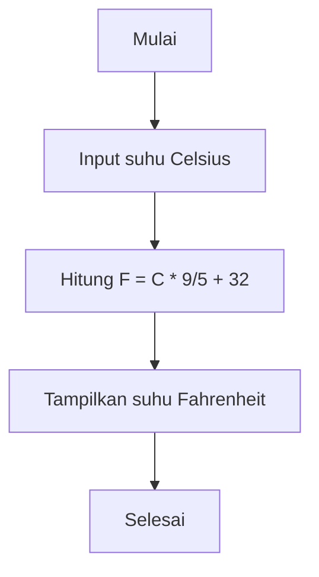

# 🚀 Materi Algoritma Dasar - Flowchart Edition

 


## 📚 Daftar Isi
- [📊 Pengenalan Flowchart](#-pengenalan-flowchart)
- [🎯 Contoh Flowchart Algoritma](#-contoh-flowchart-algoritma)
- [💡 Tips Membuat Flowchart](#-tips-membuat-flowchart)
- [🛠️ Latihan Membuat Flowchart](#️-latihan-membuat-flowchart)

## 📊 Pengenalan Flowchart

### ❓ Apa itu Flowchart?
**Flowchart** adalah diagram yang mewakili algoritma, workflow, atau proses dengan menunjukkan langkah-langkah sebagai kotak berbagai jenis dan urutannya dengan menghubungkan panah.

### 🎯 Tujuan Flowchart
- 📖 Memvisualisasikan alur program
- 🔍 Memudahkan analisis masalah
- 🗣️ Alat komunikasi antara programmer
- 🐛 Mempermudah debugging

##  Simbol-simbol Flowchart

### Simbol Dasar Flowchart


## Link Praktek
https://online.visual-paradigm.com/app/diagrams/#diagram:proj=0&type=Flowchart&width=11&height=8.5&unit=inch

## 🎯 Contoh Flowchart Algoritma

### 1. 🔢 Flowchart Penjumlahan Dua Bilangan


### 2. 📈 Flowchart Menentukan Bilangan Ganjil/Genap


### 3. 🏆 Flowchart Mencari Nilai Terbesar

```mermaid
graph TD
    A[ Mulai] --> B[ Input tiga bilangan: a,b,c]
    B --> C{◇ a > b?}
    C -->|Ya| D{◇ a > c?}
    C -->|Tidak| E{◇ b > c?}
    D -->|Ya| F[ Terbesar: a]
    D -->|Tidak| G[ Terbesar: c]
    E -->|Ya| H[ Terbesar: b]
    E -->|Tidak| I[ Terbesar: c]
    F --> J[ Selesai]
    G --> J
    H --> J
    I --> J
```



### 4. 🔁 Flowchart Perulangan Sederhana

```mermaid
graph TD
    A[ Mulai] --> B[ i = 1]
    B --> C{◇ i <= 5?}
    C -->|Ya| D[ Cetak i]
    D --> E[ i = i + 1]
    E --> C
    C -->|Tidak| F[ Selesai]
```



## 💡 Tips Membuat Flowchart

### ✅ Best Practices
1. **🎯 Mulai dari atas ke bawah**
   ```
    Mulai
     ↓
    Proses 1
     ↓
    Proses 2
     ↓
    Selesai
   ```

2. **📏 Gunakan simbol yang konsisten**
   - Simbol proses: 
   - Simbol input/output: 
   - Simbol keputusan: ◇

3. **🔤 Beri label jelas**
   - ❌ **Salah:** `Proses`
   - ✅ **Benar:** `Hitung total harga`

4. **🎨 Layout rapi dan seimbang**
   ```
   ❌ Berantakan    ✅ Rapi
   ┌─┐  ┌─┐         ┌─┐
   │A│  │B│         │A│
   └┬┘  └┬┘         └┬┘
    └─┐┌─┘            │
     ┌┴┴┐           ┌─┴─┐
     │ C│           │ B │
     └──┘           └─┬─┘
                      │
                     ┌┴┐
                     │C│
                     └─┘
   ```

## 🛠️ Latihan Membuat Flowchart

### 🎯 Latihan 1: Konversi Suhu
Buat flowchart untuk mengkonversi suhu dari Celsius ke Fahrenheit!

**Rumus:** `F = (C × 9/5) + 32`



### 🎯 Latihan 2: Cek Kelulusan
Buat flowchart untuk menentukan kelulusan berdasarkan nilai!

**Kriteria:** Lulus jika nilai ≥ 70

```mermaid
graph TD
    A[ Mulai] --> B[ Input nilai]
    B --> C{◇ Nilai >= 70?}
    C -->|Ya| D[🎉 Tampilkan Lulus]
    C -->|Tidak| E[😔 Tampilkan Tidak Lulus]
    D --> F[ Selesai]
    E --> F
```



### 🎯 Latihan 3: Kalkulator Sederhana

```mermaid
graph TD
    A[ Mulai] --> B[ Input angka1, angka2, operator]
    B --> C{◇ Operator?}
    C -->|+| D[ Hasil = angka1 + angka2]
    C -->|-| E[ Hasil = angka1 - angka2]
    C -->|*| F[ Hasil = angka1 * angka2]
    C -->|/| G{◇ angka2 = 0?}
    G -->|Ya| H[⚠️ Error: Pembagian nol]
    G -->|Tidak| I[ Hasil = angka1 / angka2]
    D --> J[ Tampilkan Hasil]
    E --> J
    F --> J
    I --> J
    H --> K[ Selesai]
    J --> K
```



## 📋 Template Flowchart Kosong

```
 MULAI
   ↓
 [PROSES 1]
   ↓
 [INPUT/OUTPUT]
   ↓
◇ [KEPUTUSAN?]
   ├─ Ya → [PROSES YA]
   └─ Tidak → [PROSES TIDAK]
   ↓
 SELESAI
```

## 🎉 Kesimpulan

### 💪 Kelebihan Flowchart
- ✅ **Visual** - Mudah dipahami
- ✅ **Universal** - Dipahami semua orang
- ✅ **Dokumentasi** - Sebagai acuan pengembangan

### 🚀 Next Steps
1. Practice membuat flowchart untuk masalah sehari-hari
2. Pelajari pseudocode sebagai alternatif
3. Implementasikan flowchart ke dalam kode program

---

<div align="center">

**⭐ Jangan lupa star repository ini jika bermanfaat!**

*Terima kasih telah belajar algoritma dengan flowchart!* 🎓

</div>
